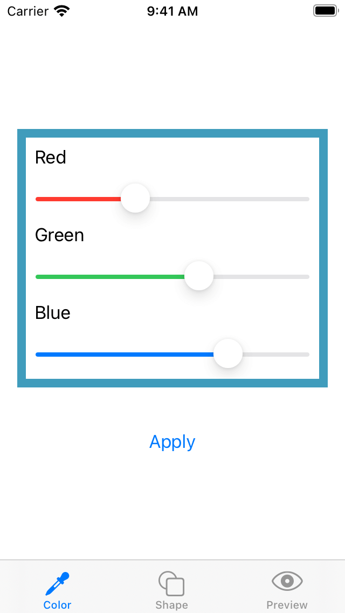
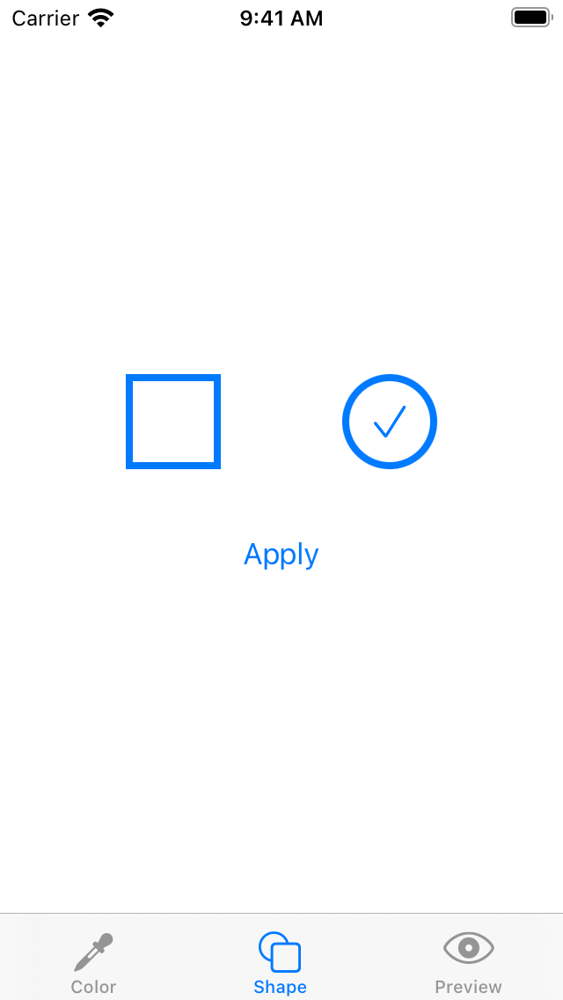
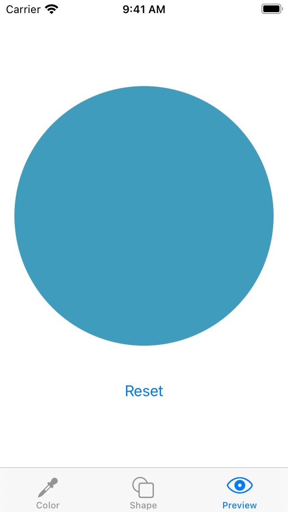

# Swift Composable App Example


|1️⃣ Adjust color|2️⃣ Select shape|3️⃣ Preview result|
|:--|:--|:--|
||||

## 📝 Description

This repository contains an example iOS app built with module composition in mind. It shows how to organize source code into separate modules, where each of them is responsible for providing different functionality in the app.

Instead of splitting the code into separate Xcode's targets that produce frameworks, this project uses Swift Package Manager support in Xcode. There is a single iOS application target in the Xcode project (with corresponding unit tests target) and several Swift packages for each corresponding app feature. Some of the advantages of this setup are:

👍 **Easier to maintain project structure**. Swift packages do not contain massive configuration in the form of `.pbxproj` file. The disk's file structure is what you work on in Xcode, and it stays in sync with it. Files are sorted alphabetically. Every folder on the disk automatically becomes a group in Xcode.

👍 **Better cooperation in a team**. Because there are no entries in `.pbxproj` for every newly added or moved file, you can avoid hard to resolve conflicts in a version control system.

👍 **Easier code reusability**. You can easily extract the package and use it in another project. Everything you need is to copy the package directory from one project to another.

👍 **Easier to manage dependencies** (as long as you use Swift Package Manager). All the libraries your code depends on are defined in `Package.swift` file. Linking between your libraries is also easy and defined in the same file. The only thing you have to do in Xcode is embedding all your package libraries in the app target.

👍 **Easier module separation**. It's straightforward to create a new module and extract a piece of your source code to it. You can focus on the app architecture and save the time you would spend creating and configuring Xcode targets.  As a result, you can achieve better composition and separation in your codebase.

## 🛠 Tech Stack

- [Xcode](https://developer.apple.com/xcode/) 12.4
- [Swift](https://swift.org/) 5.3

### 🧰 Frameworks 

- [SwiftUI](https://developer.apple.com/documentation/swiftui)
- [ComposableArchitecture](http://github.com/pointfreeco/swift-composable-architecture/)
- [SnapshotTesting](https://github.com/pointfreeco/swift-snapshot-testing)

## 🚀 Quick start

Open `ComposableApp.xcodeproj` in Xcode. You can run the app using the `ComposableApp` build scheme. Other schemes are for building and testing individual modules of the project.

## 🏛 Architecture

The following diagram explains how the project is structured:

```
+---------------+               +--------------+       +---------------+
|      App      +<--------------+    Common    +<--+---+   Library A   |
+----+-----+----+               +---+---+---+--+   |   +---------------+
     ^     ^                        |   |   |      |
     |     |    +---------------+   |   |   |      |   +---------------+
     |     +----+   Feature A   +<--+   |   |      +---+   Library B   |
     |          +---------------+       |   |      |   +---------------+
     |                                  |   |      |
     |          +---------------+       |   |      |   +---------------+
     +----------+   Feature B   +<------+   |      +---+   Library C   |
                +---------------+           |          +---------------+
                       ^                    |    
                       |                    |
                +---------------+           |
                +   Feature C   +<----------+
                +---------------+
```

- **App** - The application module
- **Feature** - Feature-specific module
- **Common** - A module containing shared logic and linking external dependencies
- **Library** - External dependency
- **A ← B** - Module A depends on module B

For easy module separation this project uses [ComposableArchitecture](http://github.com/pointfreeco/swift-composable-architecture/) library by [Point-Free](https://www.pointfree.co). 

### 🎯 Xcode project

|Target|Kind|Description|
|:--|:--|:--|
|`App`|iOS app|Main target of the app.|
|`AppTests`|iOS unit tests target|Unit tests of the app target.|

All Swift package libraries are embedded in the `App` target. The only exception is the `Testing` library used by unit test targets only and not embedded in the app.

### 📦 Common package

|Target|Kind|Description|
|:--|:--|:--|
|`Common`|library|Contains shared logic and links external dependencies.|
|`CommonTests`|unit tests|Shared logic tests.|

Every other Swift package library in the project depends on the `Common` library. The purpose of this library is to contain source code that can be shared across the whole codebase and to link external libraries. It's a single place where external dependencies are defined.

### 📦 Tabs package

|Target|Kind|Description|
|:--|:--|:--|
|`Tabs`|library|Contains tabbed user interface with screens defined in other libraries.|
|`TabsTests`|unit tests|Unit and snapshot tests of the tabbed user interface.|

`Tabs` library depends on `Color`, `Shape` and `Preview` libraries, which contain screens presented in the tabbed user interface. It also binds the logic of these screens and handles communication between them.

### 📦 Color package

|Target|Kind|Description|
|:--|:--|:--|
|`Common`|library|Contains color picker screen.|
|`CommonTests`|unit tests|Unit and snapshot tests of the color picker screen.|

This package is a feature module that contains a color picker screen in isolation from other modules.

### 📦 Shape package

|Target|Kind|Description|
|:--|:--|:--|
|`Shape`|library|Contains shape picker screen.|
|`ShapeTests`|unit tests|Unit and snapshot tests of the shape picker screen.|

This package is a feature module that contains a shape picker screen in isolation from other modules.

### 📦 Preview package

|Target|Kind|Description|
|:--|:--|:--|
|`Preview`|library|Contains screen with a preview of a shape in a given color.|
|`PreviewTests`|unit tests|Unit and snapshot tests of the preview screen.|

This package is a feature module that contains a shape preview screen. `Preview` library depends on `Color` and `Shape` libraries and uses models defined by them.

### 📦 Testing package

|Target|Kind|Description|
|:--|:--|:--|
|`Testing`|library|Contains shared testing logic and links external test dependencies.|

Every other Swift package unit tests target depends on the `Testing` library. This way, it's a single place where external test dependencies are defined.

## 🧪 Tests

There is a unit testing target that tests the main app target. This one is managed by Xcode in a traditional way. All Swift packages in the project contain a test target in addition to a library product target. You can run tests for them from Xcode by selecting a given module build scheme.

The project contains **snapshot tests** of SwiftUI views. These were recorded using iPhone 12 simulator and should be run using it. Otherwise, you can experience snapshot test failures caused by screen resolution mismatch.

## ☕️ Do you like the project?

<a href="https://www.buymeacoffee.com/darrarski" target="_blank"></a>

## 📄 License

Copyright © 2021 [Dariusz Rybicki Darrarski](http://darrarski.pl)

License: [MIT](LICENSE)
